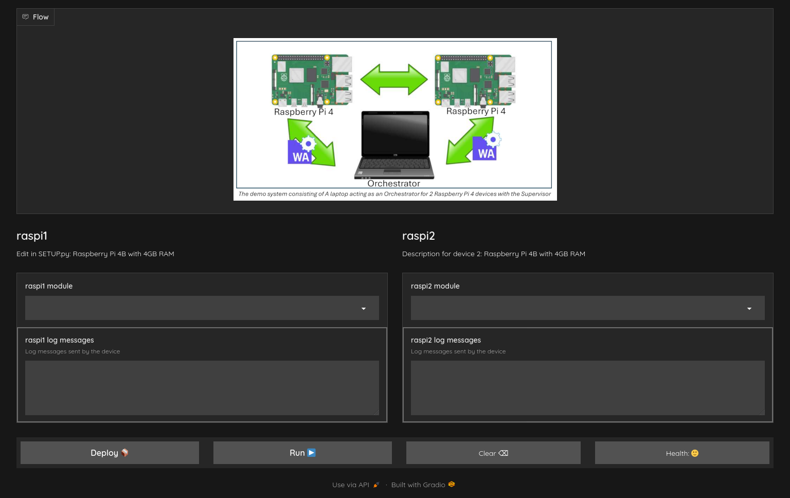
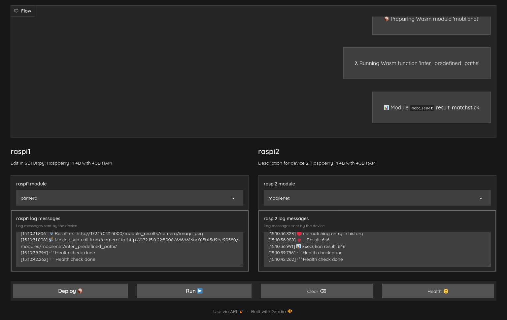

# icwe-demo
WasmIoT demonstration for ICWE 2024 conference

## Running the test setup in docker

For convenience there is a `test_system/docker-compose.yml` and `test_system/start.sh` scripts. The `start.sh` script will start the WasmIoT orchestrator ([`orchestrator`](http://localhost:3000)), the ICWE2024 demo ([`icwe-demo`](http://localhost:7860)) and two wasmiot supervisors ([`raspi1`](http://localhost:3001)) and [`raspi2`](http://localhost:3002)).

To start all or any service, run the following command:
```sh
./test_system/start.sh [service]
```

When starting from devcontainer, the default app is `icwe-demo`. To start the necessary services, run the following command:
```sh
./test_system/start.sh orchestrator raspi1 raspi2
```

If you have the project open in vscode devcontainer, you can then run the demo GUI by pressing F5. If you want to run the GUI locally, read the following instructions.

The GUI will be available at [http://localhost:7860](http://localhost:7860)

The orchestrator GUI will be available at [http://localhost:3000/](http://localhost:3000/)

### Ready made deployments

Using the orchestrator database-init functionality, there are ready-made device, module, and deployment entries that will be set to the orchestrator database at startup. These are housed in **./test-system/orchestrator-init** and the WebAssembly modules can be found at **./test-system/orchestrator-init/files**.

## Running UI locally

Create a python virtual environment and install the requirements:
```sh
python3 -m venv .venv
source .venv/bin/activate
pip install -e .[dev]
```

Run the UI:
```sh
# Optional: set the environment variable to the URL of the WasmIoT server
export WASMIOT_ORCHESTRATOR_URL=http://orchestrator.local:5000
python -m icwe-demo
```

## GUI Instructions

The demonstration GUI has been implemented with the Gradio framework. It features a process window up top and device specific information arranged in two columns below it. Each device has a dropdown menu to select a WebAssembly module to deploy. Below the dropdown menu we also have a window displaying device logs.



Once desired modules have been selected, they can be deployed by pressing the **Deploy** button. The deployment process is displayed in the process window. Once the deployment is complete, the deployed application can be executed by pressing the **Run** button. The run process and results will be displayed in the process windows.

The GUI can be cleared back to initial state with the **Clear** button, and device and connection health can be checked by pressing the **Health** button. The results are displayed in the log windows of each device. Health checks are also done automatically by the orchestrator.

Example of a deployment being run is shown in next figure:



## Citation

To cite this work, please use the following BibTeX entry:

```bibtex
@InProceedings{10.1007/978-3-031-62362-2_28,
    author="Kotilainen, Pyry
        and J{\"a}rvinen, Viljami
        and Autto, Teemu
        and Rathnayaka, Lakshan
        and Mikkonen, Tommi",
    editor="Stefanidis, Kostas
        and Syst{\"a}, Kari
        and Matera, Maristella
        and Heil, Sebastian
        and Kondylakis, Haridimos
        and Quintarelli, Elisa",
    title="Demonstrating Liquid Software in IoT Using WebAssembly",
    booktitle="Web Engineering",
    year="2024",
    publisher="Springer Nature Switzerland",
    address="Cham",
    pages="381--384",
    abstract="In this paper we introduce a demonstration of our prototype orchestration system utilising WebAssembly to achieve isomorphism for a liquid software IoT system. The demonstration hardware consists of two Raspberry Pi IoT devices and a computer acting as the orchestrator. The audience can interact with the orchestrator through a web interface to deploy different software configurations to the devices, and observe the deployment process as well as the deployed application in action.",
    isbn="978-3-031-62362-2"
}
```
